# Bomberman
## Thành viên
-
-
-
## Mô tả chung
DEMO
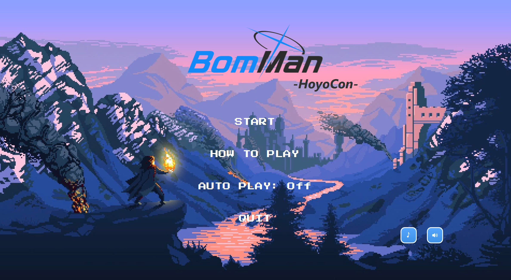|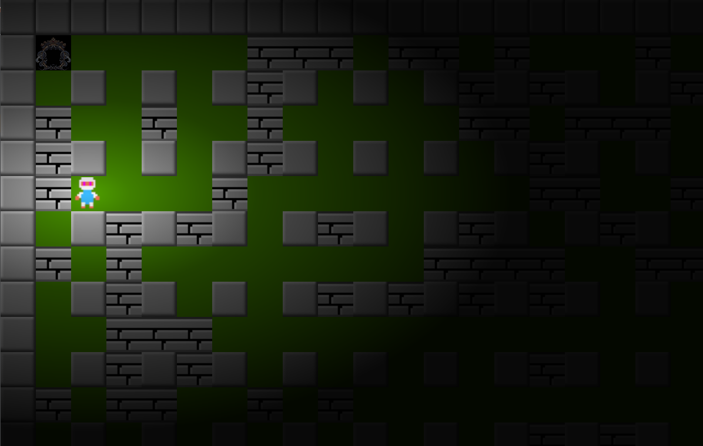
        
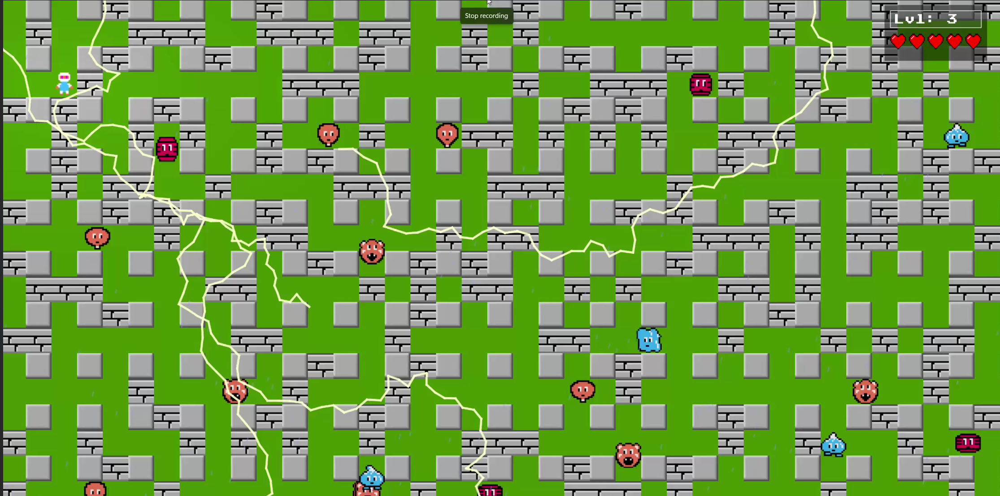|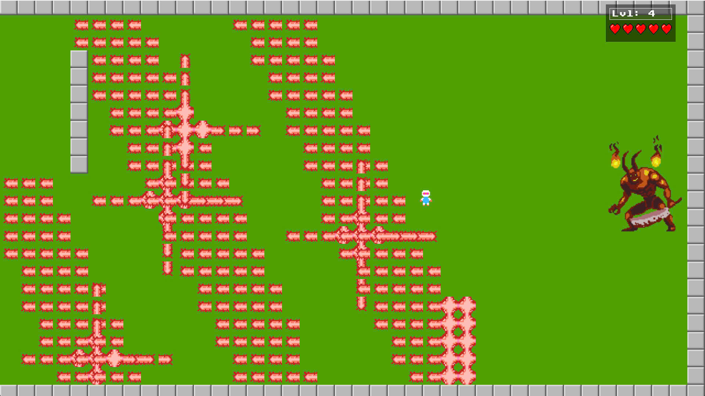
### Map
-  **Empty** là đối tượng mà **Bomber** và **Enemy** có thể di chuyển xuyên qua, và cho phép đặt **Bomb** lên vị trí của nó.
-  **Wall** là đối tượng cố định, không thể phá hủy bằng **Bomb** cũng như không thể đặt **Bomb** lên được, **Bomber** và **Enemy** không thể di chuyển qua đối tượng này.
- 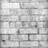 **Brick** là đối tượng được đặt lên các ô **Grass**, không cho phép đặt **Bomb** lên nhưng có thể bị phá hủy bởi **Bomb** được đặt gần đó. **Bomber** và **Enemy** thông thường không thể di chuyển vào vị trí **Brick** khi nó chưa bị phá hủy.
- 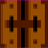 **Portal** là đối tượng nằm ở góc phải dưới cùng của **Map** khi người chơi bước qua sẽ lên level.  
### Player
- 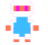 **Bomber** là nhân vật chính của trò chơi. **Bomber** có thể di chuyển theo 4 hướng trái/phải/lên/xuống theo sự điều khiển của người chơi.
- 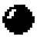 **Bomb** là đối tượng mà **Bomber** sẽ đặt và kích hoạt tại các ô **Grass**. Sau khi kích hoạt 2s, Bomb sẽ tự nổ, các đối tượng **Flame** được tạo ra và tiêu diệt **Enemy** và **PLayer** nếu nằm trong phạm vi nổ.
-  **Flame** trung tâm tại vị trí **Bomb** nổ và bốn **Flame** tại bốn vị trí ô đơn vị xung quanh vị trí của **Bomb** xuất hiện theo bốn hướng  trên/ dưới/ trái/ phải. Độ dài bốn **Flame** xung quanh mặc định là 1 đơn vị.
### Enemy
**Enemy** là các đối tượng mà **Bomber** phải tiêu diệt hết để có thể qua level. Mỗi **Enemy** sở hữu một đặc tính di chuyển và khả năng riêng. **Enemy** càng khó để tiêu diệt thì có điểm thưởng càng cao.
-  **Balloon** là Enemy đơn giản nhất, di chuyển ngẫu nhiên với tốc độ chậm.
-  **Oneal** di chuyển ngẫu nhiên khi **Player** chưa vào tầm phát hiện, khi **Player** vào tầm nó sẽ truy đuổi.
-  **Pass** di chuyển ngẫu nhiên với tốc độ khá nhanh. Khi bị tiêu diệt sẽ sinh ra thêm 2 **Ballom**.
-  **Dahl** có tốc độ di chuyển thay đổi, lúc nhanh, lúc chậm.
-  **Doria** biết đuổi Bomber khi lại gần nhưng phạm vi rộng hơn Oneal, có tốc độ di chuyển tăng và có thể di chuyển xuyên Brick trong khi đuổi **Player** .
### Item
*Item* được giấu phía sau Brick và chỉ hiện ra khi Brick bị phá hủy. Bomber có thể sử dụng Item bằng cách di chuyển vào vị trí của Item. Thông tin về chức năng của các Item được liệt kê như sau:

- 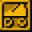 **SpeedItem** Item này sẽ giúp Bomber được tăng tốc độ di chuyển.

-  **BombItem** Item này giúp tăng số lượng Bomb có thể đặt thêm một.

- 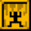 **FlamePassItem** Khi sử dụng Item này Bomber sẽ được mặc giáp Vàng và có thể đi qua Flame mà không bị sao.

-  **FlameItem** Item này giúp tăng phạm vi ảnh hưởng của Bomb khi nổ.

-  **LifeItem** Khi sử dụng Item này Bomber sẽ được tăng thêm 1 mạng nữa.
### BOSS!!!
- 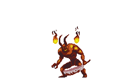 **BOSS** là kẻ đứng ở màn 4 có 3 skill đặc biệt nhưng không biết di chuyển.

### Gameplay
- Trong một màn chơi, **Bomber** sẽ được người chơi di chuyển, đặt và kích hoạt **Bomb** với mục tiêu chính là tiêu diệt tất cả **Enemy** và đi tới vị trí **Portal** để có thể qua level mới.
- **Bomber** sẽ bị tiêu diệt khi va chạm với **Enemy**, thuộc phạm vi **Bomb** nổ, hoặc trúng skill của **BOSS**. Lúc đấy trò chơi kết thúc.
- **Enemy** bị tiêu diệt khi thuộc phạm vi Bomb nổ.
- **BOSS** sẽ mất HP khi trúng **Bomb**
## Class Diagram

## Gói tính năng bắt buộc
- Thiết kế cây thừa kế cho các đối tượng game.
- Xây dựng bản đồ màn chơi từ tệp cấu hình.			
- Di chuyển **Bomber** theo sự điều khiển từ người chơi.
- Tự động di chuyển các **Enemy**.
- Xử lý va chạm cho các đối tượng **Bomber**, **Enemy**, **Wall**, **Brick**, **Bomb**.
- Xử lý **Bomb** nổ.
- Xử lý khi **Bomber** sử dụng các **Item** và khi đi vào vị trí **Portal**.
## Gói tính năng tùy chọn
- Sử dụng Git trong nhóm.
- Sử dụng thuật toán tìm đường BFS cho **Enemy**.
- Cài đặt đa dạng **Enemy** và **Item**.
- Xử lý hiệu ứng âm thanh.
- Cài đặt Menu cho trò chơi.
- Lưu điểm cao nhất của người chơi (thao tác với tệp).
## Các công nghệ sử dụng
- Ngôn ngữ: Java (JDK23).
- Framework: JavaFx.
